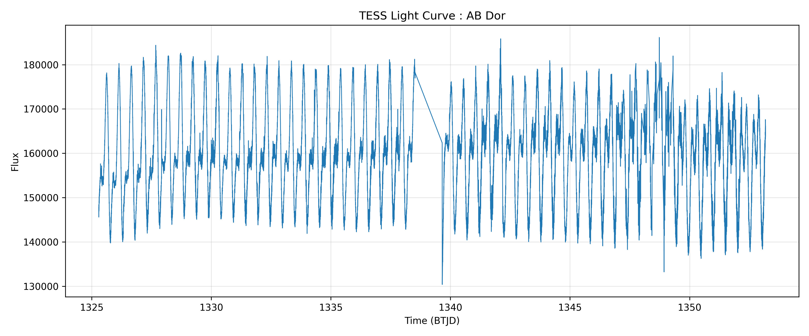

# TESS Light Curve Plotter

A beginner astronomy project for downloading, visualizing and exploring TESS light curves using Python and Lightkurve.

## Features

- Download light curves from TESS
- Visualize stellar brightness variations
- Plot time vs flux observations
- Save output images
- Explore stellar variability

## Dataset

Mission: **TESS (Transiting Exoplanet Survey Satellite)**

Target used in this project:

**AB Dor**

## Output Preview

---

## Tools Used

- Python
- Lightkurve
- Astropy
- NumPy
- Matplotlib

## Scientific Context

This project demonstrates retrieval and visualization of stellar light curves from TESS observations and serves as an introductory workflow for stellar variability analysis and future light-curve research.

